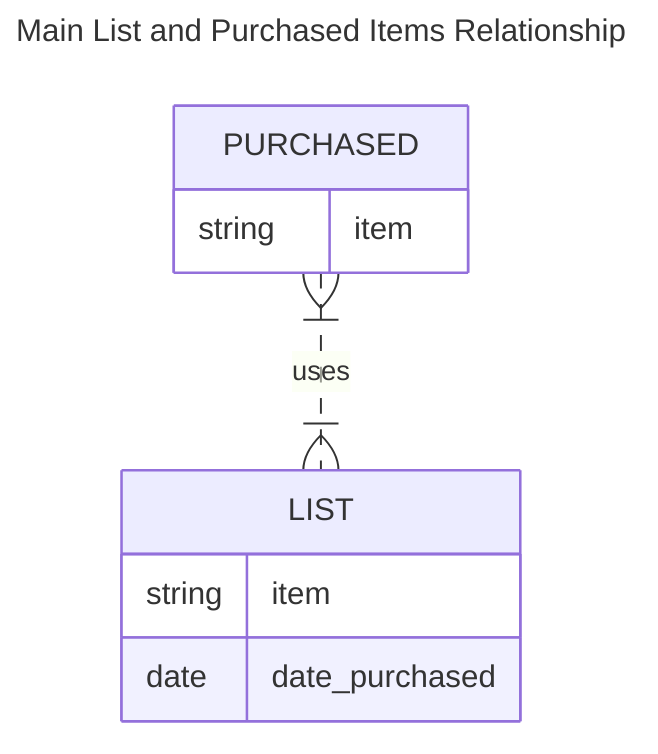

```mermaid
---
title: Main List and Purchased Items Relationship
---
erDiagram

    PURCHASED {
        string item
    }
    LIST {
        string item
        date date_purchased
    }


    PURCHASED}|..|{ LIST : uses

```